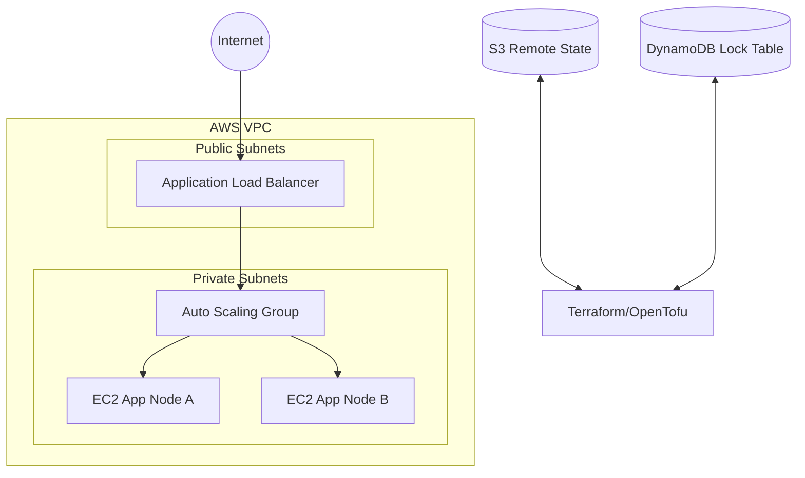

# Terraform AWS Production Baseline v2

Production-oriented AWS baseline built with **Terraform/OpenTofu**, structured the way a small platform team might maintain shared infrastructure. This version is intentionally more portfolio-ready than a minimal demo: it includes clearer environment separation, tagging, validation, optional cost-aware settings, and a workflow foundation for reviewable infrastructure changes.

## Highlights

- Multi-module AWS baseline
- Environment structure for `dev` and easy extension to `staging` / `prod`
- VPC with public/private subnets across multiple AZs
- Application Load Balancer
- Launch Template + Auto Scaling Group
- IAM instance profile
- Remote state example
- Tagging strategy
- Variable validation
- GitHub Actions CI for fmt / validate / lint / tfsec

## Architecture



## Repository structure

```text
.
├── .github/workflows/terraform-ci.yml
├── backend.hcl.example
├── envs/
│   └── dev/
│       ├── locals.tf
│       ├── main.tf
│       ├── outputs.tf
│       ├── terraform.tfvars.example
│       └── variables.tf
├── modules/
│   ├── alb/
│   ├── app_asg/
│   ├── network/
│   └── security/
└── versions.tf
```

## Why this repository matters

This repository is designed to show:

- Solid **Infrastructure as Code structure**
- Awareness of **scalability, security, and maintainability**
- Familiarity with **reviewable and automated infrastructure workflows**
- Practical alignment with **DevOps / Platform / SRE roles**

## Quick start

### Prerequisites

- Terraform or OpenTofu
- AWS CLI configured
- AWS account with appropriate permissions

### Configure backend

```bash
cp backend.hcl.example backend.hcl
```

### Initialise and plan

```bash
cd envs/dev
terraform init -backend-config=../../backend.hcl
terraform plan -var-file=terraform.tfvars
```

### Apply

```bash
terraform apply -var-file=terraform.tfvars
```

## Design decisions

### 1. Public ALB, private application tier
The load balancer is internet-facing, while application nodes remain in private subnets to reduce direct exposure.

### 2. Environment-driven inputs
The `envs/dev` layout makes it easier to split variables, tags, and scaling parameters by environment without duplicating module logic.

### 3. Tagging and validation
The repository includes a basic tagging strategy and variable validation because these are common expectations in real teams.

### 4. Cost-aware defaults
The baseline is designed to be extended with:
- scheduled scaling
- Spot support
- rightsizing
- lifecycle governance

## Suggested v3 enhancements

- Route53 + ACM for HTTPS
- NAT gateway strategy and egress controls
- ECS or EKS variant
- CloudWatch alarms and dashboards
- OIDC-based GitHub Actions deployment
- Blue/green or rolling deployment strategy

## Notes

This is a portfolio repository, not a turnkey production platform. It demonstrates structure, tradeoffs, and operational thinking.
